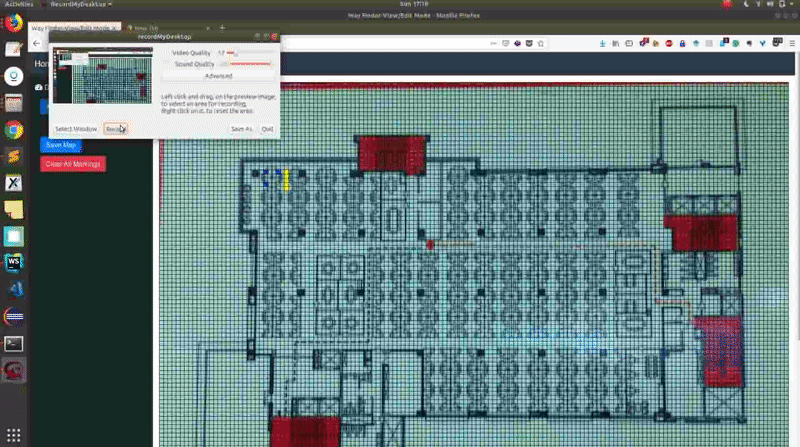
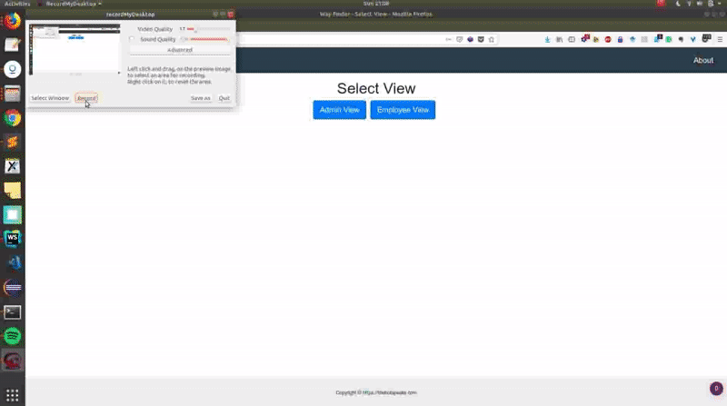

# README

Wayfinder is an indoor mapping solution for helping people navigate indoors. It has been built using NodeJS and MongoDB. The navigation engine is powered by the A-star algorithm. 
[This is the JS implementation](https://github.com/bgrins/javascript-astar/tree/0.0.1) of A star algorithm used in this project. 

[Here is the detailed writeup](https://thebotspeaks.com/Way-Finder/) for this project. 

## Technology stack

 - NodeJS - v8.12.0
 - npm - 6.4.1
 - MongoDB - 4.0.5

## Map SetUp Demo Screen

## Search Demo Screen

## Todo

- [ ] About page
- [X] Team field for employee
- [ ] Grid resizing on window resizing
- [X] Marking seats as blue colored
- [X] Disable mark-assistance radio buttons in view mode
- [ ] Tooltip text for seat.
- [ ] Mark lane assistance with click instead of manually entering coordinates.
- [X] Rename map functionality for employee collection as well.
- [ ] Search by team name
- [ ] validation on save seat
- [X] Writeup
- [X] Remove border from final search page
- [ ] Search using just name
- [ ] Fix class toggle/addition bug for seats and hallway
- [ ] Fix error page
- [ ] Save map from save-seat click
- [X] Highlight destination node in the final search green color.
- [ ] Clear search result when multiple back-to-bak searches are made
- [ ] Clear additional CSS file